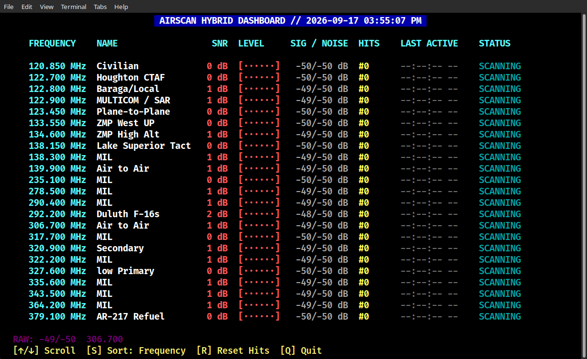

# AirScan Hybrid Dashboard

A high-visibility, curses-based terminal dashboard for monitoring aviation and marine radio communications using `rtl_airband`.

AirScan Hybrid turns standard RTL-SDR dongles into an automated scanning station, providing dynamic sorting, real-time signal strength metrics, visual SNR metering, and automated audio housekeeping in a clean terminal user interface (TUI).

---



---

## Key Features

* **Dynamic Adaptive Sorting (`S` Key):** Cycle on-the-fly between **Frequency** (numerical order), **Most Hits** (highest activity channels ranked at the top), and **Recent** (most recently active frequencies jump immediately to row 1).
* **Real-Time SNR Metering:** Automatic Signal-to-Noise Ratio calculation paired with a dynamic ASCII bar graph and colored signal ramps (Green for strong, Yellow for moderate, Red for weak).
* **Dedicated JSON Configuration (`settings.json`):** Tune SDR gain, squelch threshold, serial device IDs, and retention policies in an external config file without modifying application code.
* **Configurable Auto-Pruning Housekeeper:** Background thread automatically purges old audio clips after a user-defined retention period, or can be disabled entirely to keep all recordings indefinitely.
* **Timestamped Audio Filenames:** Recordings are saved with exact date and time templates (`airband_YYYYMMDD_HHMMSS`), eliminating filename collisions.
* **Auto-Generated Configuration:** Automatically generates a clean, valid `rtl_airband.conf` on launch by parsing your `channels.csv` and `settings.json`.
* **Smooth Channel Scrolling:** Navigate long frequency lists with standard Up/Down arrow keys.
* **12-Hour Activity Clock:** Formats all scan events, transmission logs, and headers using standard 12-hour time (`HH:MM:SS AM/PM`).

---

## Installation & Setup

1. **Clone the repository:**
```bash
git clone https://github.com/UPMI-Scanner/airscan_hybrid.git
cd airscan_hybrid
```

2. **System Requirements:**
* Linux (Debian, Ubuntu, Raspberry Pi OS, Mint, etc.)
* Python 3.8+
* `rtl_airband` installed and accessible in your system `$PATH`

---

## Hardware Configuration (`settings.json`)

Hardware settings are managed in `settings.json`. If this file does not exist, AirScan Hybrid creates it automatically on first launch with safe defaults:

```json
{
  "sdr_device": "serial = \"AIR\";",
  "gain_level": 33.0,
  "squelch_level": 19.0,
  "retention_hours": 24
}
```

* **`sdr_device`:** Hardware identifier string for `rtl_airband` (e.g., `serial = "AIR";` or `index = 0;`).
* **`gain_level`:** Tuner gain in dB (e.g., `33.0` or `0` for AGC).
* **`squelch_level`:** Squelch SNR threshold in dB. Transmissions must exceed this SNR to unmute and record.
* **`retention_hours`:** Number of hours to retain recordings before pruning. Set to `0` to disable automatic deletion completely.

---

## Channel Setup (`channels.csv`)

Add, edit, or remove monitoring channels using standard CSV formatting in `channels.csv`:

```csv
Frequency,Name
118.100,Local Tower
122.800,Unicom CTAF
121.500,Aviation Emergency
133.550,ZMP Center
```

* **Column 1:** Frequency in MHz
* **Column 2:** Channel label / agency description

---

## Usage

Launch the dashboard directly from your terminal:

```bash
python3 hybrid_ui.py
```

---

## Keyboard Controls

| Key | Action |
| :--- | :--- |
| **`↑` / `↓`** | Scroll up or down through the channel list |
| **`S`** | Cycle sorting modes (**Frequency** → **Most Hits** → **Recent**) |
| **`R`** | Reset all channel hit counters to zero |
| **`Q`** | Quit dashboard and cleanly shut down the SDR background engine |

---

## Acknowledgments & Prerequisites

This dashboard requires **rtl_airband** installed on the host system to serve as the radio scanning engine:
* [RTLSDR-Airband GitHub Repository](https://github.com/szpajder/RTLSDR-Airband) by Tomasz Lemiech (`szpajder`).
